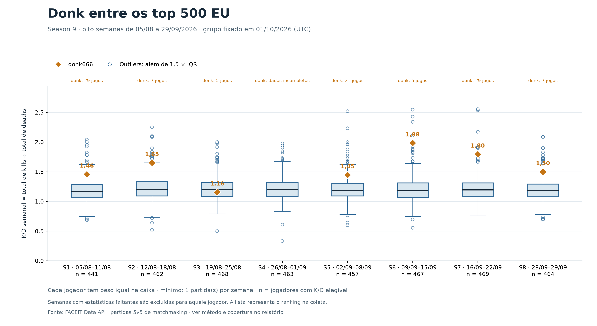

# Donk entre os top 500 EU — análise semanal

## Resultado

Donk aparece como outlier superior em **2 das 7 semanas com K/D elegível**. O gráfico contém oito semanas; uma semana sem valor elegível não conta como desempenho normal nem como K/D zero.

| Semana | Período (UTC) | Jogadores válidos | Jogos do donk com dados | K/D donk | Mediana do grupo | Limite superior | Classificação |
|---|---|---:|---:|---:|---:|---:|---|
| 1 | 05/08–11/08 | 441 | 29 | 1,46 | 1,17 | 1,63 | Dentro dos limites |
| 2 | 12/08–18/08 | 462 | 7 | 1,65 | 1,20 | 1,69 | Dentro dos limites |
| 3 | 19/08–25/08 | 468 | 5 | 1,16 | 1,20 | 1,65 | Dentro dos limites |
| 4 | 26/08–01/09 | 463 | 16 | — | 1,20 | 1,68 | Estatísticas incompletas |
| 5 | 02/09–08/09 | 457 | 21 | 1,45 | 1,19 | 1,63 | Dentro dos limites |
| 6 | 09/09–15/09 | 467 | 5 | 1,98 | 1,18 | 1,67 | Outlier superior |
| 7 | 16/09–22/09 | 469 | 29 | 1,80 | 1,19 | 1,65 | Outlier superior |
| 8 | 23/09–29/09 | 464 | 7 | 1,50 | 1,19 | 1,62 | Dentro dos limites |

## Base e cobertura

- Grupo fixo: 500 jogadores do ranking EU capturado em 01/10/2026 (UTC), com duas leituras consecutivas idênticas de IDs, posições e Elo.
- Janela por datas UTC: 05/08/2026 00:00 até 30/09/2026 00:00, com fim exclusivo. O dia 30/09 não faz parte da análise.
- Participações jogador-partida com estatísticas: 83,340; partidas distintas: 42,845.
- Participações esperadas no histórico: 83,373; sem estatística individual recuperável: 33.
- Combinações jogador-semana: 4.000; com dados incompletos: 33; sem partidas: 276.
- Conferência independente: 56 participações comparadas ao endpoint de estatísticas por partida, todas concordantes. Essa verificação dirigida não garante que a API esteja livre de erros desconhecidos.
- A coleta percorreu os 500 históricos. Toda partida esperada está registrada como coletada ou como lacuna; nenhuma falha vira zero.

## Método

Cada caixa representa a distribuição de **um valor por jogador naquela semana**. O K/D é a soma de kills dividida pela soma de deaths, não a média dos K/D de partidas. Cada jogador tem o mesmo peso na distribuição, independentemente de quantas partidas jogou.

As oito semanas são blocos de sete dias do calendário UTC: 05–11/08, 12–18/08, 19–25/08, 26/08–01/09, 02–08/09, 09–15/09, 16–22/09 e 23–29/09. A atribuição usa o término registrado no histórico oficial. O início em meia-noite é uma convenção de calendário do estudo, não uma afirmação sobre o horário exato de abertura da Season 9.

Entram partidas concluídas de matchmaking CS2 5v5 dos jogadores selecionados, incluindo a Challenger Queue. EU define a lista de jogadores, não restringe o servidor das partidas: jogos desses jogadores em outras regiões também entram. Hubs, torneios e outros formatos ficam fora. As filas observadas são documentadas na verificação.

Para cada semana, Q1 e Q3 usam interpolação linear. IQR = Q3 − Q1. Um valor é outlier quando é estritamente menor que Q1 − 1,5 × IQR ou maior que Q3 + 1,5 × IQR. Os bigodes chegam aos valores observados dentro desses limites. Donk participa dos quartis e segue a mesma regra dos demais.

O mínimo principal é uma partida. Sem partidas, com zero deaths ou com qualquer estatística faltante naquela semana, o K/D do jogador fica ausente. Seus dados observados são preservados nas tabelas, mas não entram na caixa. A análise de sensibilidade em `sensitivity_donk.csv` repete a classificação com mínimos de 5 e 10 partidas.

O FACEIT Rating de desempenho não apareceu nos campos consultados; K/D é a alternativa autorizada. Elo é usado somente para selecionar o grupo, nunca como métrica de desempenho nos boxplots.

## Sensibilidade e leitura para a apresentação

Com mínimo de cinco partidas, as classificações do donk nas semanas elegíveis permanecem iguais às da análise principal. Com mínimo de dez, as semanas 2, 3, 6 e 8 deixam de ter amostra suficiente para ele; a semana 7 permanece como outlier superior. Portanto, o resultado da semana 6 se apoia em apenas cinco partidas, enquanto o da semana 7 se apoia em 29.

O grupo fixo tem 500 jogadores, mas cada caixa inclui apenas quem tem K/D elegível na semana. O número de jogadores válidos varia de 441 a 469. A tabela `outlier_recurrence.csv` resume a frequência de outliers de cada jogador e quantas semanas puderam ser analisadas.

## Limites da interpretação

Este é um estudo descritivo do **top 500 no momento da coleta**, observado retrospectivamente. Não representa os top 500 de cada semana nem o ranking final de setembro. A seleção por desempenho posterior limita a generalização para todos os jogadores.

As quantidades de partidas diferem entre jogadores e semanas. Valores baseados em poucas partidas são menos estáveis; confira a sensibilidade antes de tirar conclusões. As semanas reutilizam jogadores, e jogadores podem compartilhar partidas: observações não são independentes. A regra de outliers não é um teste de significância e o K/D não mede sozinho o impacto completo no jogo.

Datas e estatísticas podem conter falhas ou atualizações administrativas da fonte. As lacunas conhecidas foram registradas e excluídas por jogador-semana; isso não garante ausência de omissões desconhecidas na API. O recorte usa dias UTC a partir da data anunciada de lançamento; a diferença entre meia-noite e o horário exato de abertura deve ser considerada ao discutir a primeira semana.

## Material para a apresentação futura

1. Pergunta: o donk se destaca mesmo entre os atuais top 500 EU?
2. Dados: explicar a fotografia do ranking, as oito semanas, a métrica e a cobertura.
3. Método: um valor por jogador e semana; explicar caixa, mediana, bigodes e outliers.
4. Resultado: usar a figura e a tabela acima, separando semanas observadas e ausentes.
5. Limitações: seleção do grupo, volume de partidas e lacunas da fonte.

O PNG serve para slides; SVG e PDF preservam qualidade ao ampliar. As tabelas e os manifestos permitem conferir os números. A apresentação ainda não foi montada.

## Fontes

- [FACEIT Data API](https://docs.faceit.com/docs/data-api/data/): ranking, histórico e estatísticas. URLs e respostas brutas são preservadas localmente.
- [Anúncio da Season 9](https://support.faceit.com/hc/en-us/articles/28898322786076-Season-9-A-Lighter-Soft-Elo-Reset-Personalised-with-your-recent-win-rate-and-FACEIT-Rating): data de início em 5 de agosto.
- [Challenger Queue](https://support.faceit.com/hc/en-us/articles/29091864551708-Season-9-Challenger-Queue-FAQ): evento de 5 a 9 de agosto.
